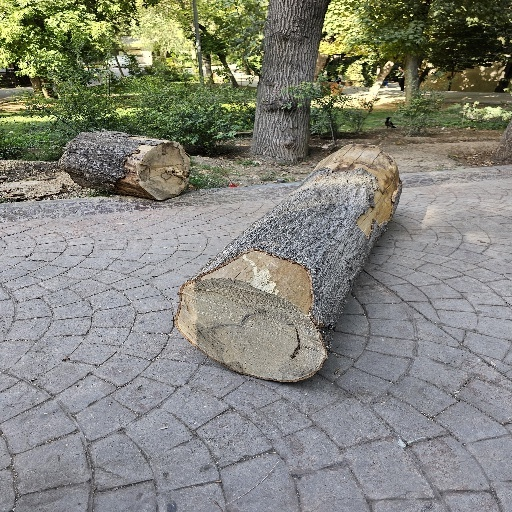
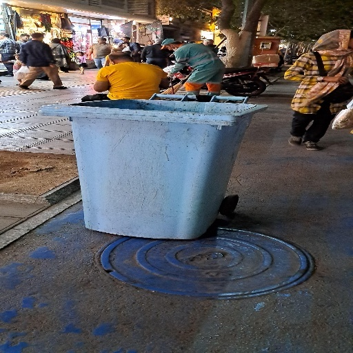
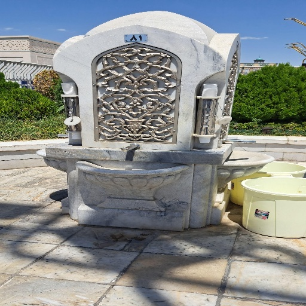

# PortSet
**PortSet** is a dataset for focusing on foreground objects in an image (like Portrait mode in phones!). This dataset is created so that you can train models which can detect background objects, foreground objects or even learn to directly blur the unimportant stuff in an image!

## Dataset
The dataset contains xxx images. 756 of them are realworld images (marked with `real_world`) and zzz of them are synthesized images (marked with `synthesized`). The synthesized images are created using _blender v3.0_ and different 3D objects and rendering conditions. More on the synthesis process can be found in the [synthesis](###synthesis) section.

The dataset consists of different imaging conditions and different camera positions, for sake of generalization. Also the pictures contain **indoor** and **outdoor** scenes. For example, you can see a set of input_image + blurred_image in 2 different conditions, below:

<div style="text-align:center">


</div>

<div style="text-align:center">


</div>

Also it contains different lighting conditions (Day / Night) as you can see below:

<div style="text-align:center">


</div>

And as you can see, it contains many different objects and scenes (the list of objects + bounding boxes will be added soon, so you can use this dataset also for object detection tasks). **Note** that all of the images are 512x512 pixels.

### Synthesis
The dataset also contains `synthesized` part which is the images that are created in virtual 3D modelling environments (we used _blender v3.0_). The images are created using different 3D objects and different lighting conditions. The blender scenes and objects can be downloaded from [here](https:/todo). We also created a script in this repository named `blender_manager.py` which you can use to create your own synthesized data! The script is very simple to use, you can use it like this:

1. Create your scene in the blender.
2. Make your camera look-at the object you want (so it keeps pointing in the right direction while the camera is rotating around the scene). You can use `add constraint` to do this.
3. Open the `blender_manager.py` script in the Scripting tab of blender and click to run it.
   
Here you can see some of the synthesized data and how they look like:

<div style="text-align:center">


</div>


## Download and Usage
Please first, download the main dataset file from [here](https://todo) and extract it in the folder named `Dataset/`. Now, based on the framework you use, you can use our dataset ports easily!

First, please do these steps to setup a pip environment (optional) and install required packages:

```
!python3 -m venv ./venv
!source activate ./venv/bin/activate
```
```
pip install -r requirements.txt
```

### Tensorflow
If you are using tensorflow, copy the `Dataset/` folder into the `tensorflow_portset/` folder. Then run this command (simply go to the tensorflow folder):

```
cd tensorflow_portset/
``` 

Now run this command to build the tensorflow port:

```
tfds build --manual_dir=Dataset/
```

Now you can simply use the dataset in your code, like this:

```
import tensorflow_datasets as tfds

dataset = tfds.load('tensorflow_portset', split='real_world', shuffle_files=True)
```

Note that you can split the different sections (`real_world` and `synthesized`) using tensorflow's own built-in functions and create for example, 80% train data and 20% test data.

### Pytorch
If you are using pytorch, copy the `Dataset/` folder into the root folder of dataest (or where you are using it). Then you can use the pytorch dataset as simple as below:

```
from pytorch_portset import PortsetDataset

dataset = PortsetDataset(root='Dataset/', split='real_world', transform=None, target_transform=None)
```

Obviously you can set the `transform` and `target_transform` to whatever transformations you want. The root argument is the path to the `Dataset/` folder.

## How to use this dataset
If you are still wondering how to use this dataset or what the tuple of the image & blurred_image will look like, please see the `inference.ipynb` notebook which is provided in the root of this repository. It contains a simple example of how to use this dataset.

## Citation
If you use this dataset in your work, please cite it like this:

```
@DATASET {PortSet, 
title = {"PortSet: A Dense and Rich Dataset for Portrait Image Creation (Background detection"},
authors = {"AmirHossein Naghi Razlighi", "Iman Mohammadi", "Mehrab Moradzadeh", "Mohammad Namdar", "Soroush Jahanzad"}
edition= "1.0",
year = "2023"
}
```
